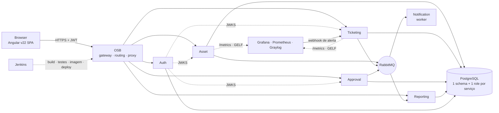
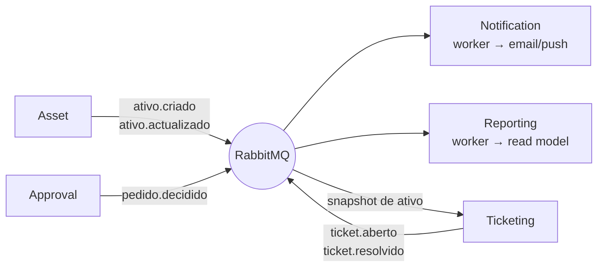

# Arquitetura — Plataforma OPS (Direção de Operações)

> Documento de referência da arquitetura do monorepo `ops/`.
> Descreve **o que** o sistema é. O **porquê** de cada escolha estrutural — incluindo as
> alternativas rejeitadas — está nos ADR em [`docs/adr/`](docs/adr/README.md):
>
> | | | |
> |---|---|---|
> | [0001](docs/adr/0001-monorepo-unico.md) | Monorepo único no Bitbucket | §5 |
> | [0002](docs/adr/0002-decomposicao-por-bounded-context.md) | Decomposição por bounded context | §3 |
> | [0003](docs/adr/0003-estrutura-enxuta-em-vez-de-hexagonal.md) | Estrutura enxuta em vez de hexagonal completo | §2, §4, §9 |
> | [0004](docs/adr/0004-pastas-planas-departamento-como-metadado.md) | Pastas planas, departamento como metadado | §5 |
> | [0005](docs/adr/0005-ops-common-com-contexto-de-build-na-raiz.md) | `ops_common` com contexto de build na raiz | §5.1 |
>
> Mantido em conjunto com o código: alterações estruturais refletem-se aqui **e** dão origem a
> um novo ADR — os ADR existentes não se reescrevem, substituem-se.

---

## 1. Visão geral

Plataforma de microserviços para as operações internas, com SPA em Angular, gateway Oracle
Service Bus, serviços FastAPI em contentores Docker, PostgreSQL como base de dados,
RabbitMQ para comunicação assíncrona e a stack Grafana/Prometheus/Graylog para observabilidade.



### Stack

| Camada | Tecnologia |
|---|---|
| Frontend | Angular v22, TypeScript |
| Backend | Python, FastAPI, openpyxl (importação Excel) |
| API Management | JWT (RS256, JWKS) |
| ORM / Migrações | SQLAlchemy, Alembic |
| Middleware | Oracle Service Bus (OSB), RabbitMQ |
| Base de dados | PostgreSQL |
| Monitorização | Grafana, Prometheus, Graylog |
| Servidor / Contentores | Docker Engine, Docker Compose |
| DevOps | Bitbucket, Jenkins, Swagger/OpenAPI, Selenium, JMeter |

---

## 2. Princípios

**Investir no que é caro de reverter; adiar o que é barato de acrescentar.**
É o critério que decide, caso a caso, se uma abstração entra hoje ou não.

**Caro de reverter — está no desenho desde o dia um:**

- **Um schema *e um role* Postgres por serviço.** A única decisão que não se retrofita: quando
  dois serviços partilham tabelas, separá-los passa a ser um projeto de meses.
- **`/api/v1/` no caminho.** Acrescentar versionamento depois obriga a mexer no OSB e no Angular.
- **DTOs Pydantic separados dos models SQLAlchemy.** Expor colunas da BD no JSON prende o contrato
  REST ao esquema de tabelas.
- **Correlation-id nos logs.** Sem ele, o Graylog é um agregador que não consegue seguir um pedido
  entre serviços. Custa ~15 linhas de middleware.

**Barato de acrescentar quando doer — fica de fora:**
`domain/entities/`, `value_objects/`, `domain/ports/`, `mappers.py`, contentor de DI próprio
(o `Depends()` do FastAPI já o é), Unit of Work (sessão-por-request chega), outbox, testes de
contrato, import-linter e cookiecutter. Ver secção 9 para os gatilhos de entrada de cada um.

**O que muda junto, fica junto; o que tem ritmo de mudança ou dono diferente, separa.**
É o critério de decomposição — e a defesa contra os dois erros simétricos: excesso de camadas
dentro de cada serviço, e fragmentação em nano-serviços entre eles.

---

## 3. Decomposição em microserviços

Decomposição por **bounded context**, não por funcionalidade nem por departamento. Um serviço
por funcionalidade trocaria chamadas de função por latência de rede e produziria um monólito
distribuído; o departamento, por sua vez, muda mais depressa que o código e há contextos
(Approval, Notification) que são transversais a vários.

| Funcionalidade | Bounded context |
|---|---|
| Login, permissões, roles | **Auth** |
| Tickets, incidentes, atribuição | **Ticketing** |
| Inventário, ativos, licenças | **Asset** |
| Agendamento de manutenção | **Asset** — manutenção é sobre o ativo, muda com ele |
| Pedidos de aprovação (compra, acesso, mudança) | **Approval** — genérico, reutilizado pelos outros |
| Alertas de monitorização | *nenhum* — fica no Grafana/Prometheus; só dispara evento para Ticketing se virar incidente |
| Relatórios / auditoria | **Reporting** — read model, consome eventos |
| Notificações | **Notification** — genérico, consome eventos de todos |
| Importação/exportação Excel | *nenhum* — é `infrastructure/files/excel/` dentro de quem precisa dela |

Seis serviços: `auth`, `ticketing`, `asset`, `approval`, `notification`, `reporting`.

### 3.1 Perfis de serviço

Os seis não têm a mesma forma, e o esqueleto reflete isso:

| Perfil | Serviços | Entrypoints |
|---|---|---|
| **HTTP puro** | Auth | `main.py` |
| **HTTP + publisher** | Ticketing, Asset, Approval | `main.py` + `infrastructure/messaging/publisher.py` |
| **Worker-first** | Notification, Reporting | `worker.py` como principal; `main.py` serve `/health`, `/metrics` e (no Reporting) leituras |

O **Asset** tem um terceiro entrypoint — o agendamento de manutenção. Começa como `scheduler.py`
no mesmo contentor (APScheduler); separa-se só se o volume o justificar.

**Ticketing e Approval** são os candidatos naturais a ganhar `domain/` primeiro: têm máquinas de
estado reais (`aberto → atribuído → resolvido → fechado`, `submetido → aprovado/rejeitado`), que é
precisamente a regra de negócio que justifica isolar o domínio.

### 3.2 Fluxo de eventos



### 3.3 Regras de acoplamento

O risco de monólito distribuído não desaparece por serem seis serviços e não vinte — muda de
sítio. Três regras concretas, verificáveis:

1. **Nada de chamada síncrona no caminho de leitura.** Um ticket refere um ativo, mas o Ticketing
   **não** chama o Asset a cada leitura. Guarda `asset_id` mais um *snapshot* dos campos que
   precisa de mostrar (código, designação), actualizado por evento. Se o Ticketing só ficar de pé
   enquanto o Asset estiver de pé, são um serviço só com rede pelo meio.
2. **O Approval não conhece os outros domínios.** É genérico ou não é reutilizável: recebe
   `tipo_de_pedido`, um `payload` opaco e um `callback`/evento de decisão; devolve
   `aprovado`/`rejeitado`. No dia em que tiver um `if tipo == "compra_de_ativo"`, deixou de ser
   genérico e passou a estar acoplado ao Asset.
3. **O Reporting é read-only e eventualmente consistente.** Constrói o seu próprio schema
   denormalizado a partir dos eventos; nunca lê os schemas dos outros. Isto tem de ser acordado
   com o negócio à partida — um relatório pode estar segundos atrás da operação.

**Alertas**: o alerting do Grafana faz webhook para um endpoint de entrada do Ticketing (ou publica
em RabbitMQ), que decide se abre incidente. O Ticketing não faz *polling* ao Prometheus.

---

## 4. Camadas de um microserviço

Regra base: **`controllers → services → infrastructure`**, com apenas a camada `api/` a depender
do FastAPI e apenas `infrastructure/persistence/` a depender do SQLAlchemy.

```
services/asset/
├── src/
│   └── asset/                       # pacote instalável (nome = import path)
│       ├── main.py                  # app factory FastAPI + lifespan
│       ├── worker.py                # (perfis worker-first e consumidores)
│       ├── scheduler.py             # (só Asset — manutenção agendada)
│       ├── core/
│       │   ├── config.py            # pydantic-settings, env vars
│       │   ├── security.py          # verificação do JWT (usa ops_common)
│       │   ├── exceptions.py        # exceções de negócio do serviço
│       │   └── logging.py           # GELF → Graylog, com correlation-id
│       ├── api/
│       │   ├── health.py            # /health (liveness) e /ready (Postgres) — fora de /v1
│       │   ├── error_handler.py     # único mapeamento exceção → status HTTP
│       │   └── v1/
│       │       ├── router.py        # agregador dos controllers
│       │       ├── controllers/     # um módulo por recurso — única camada com FastAPI
│       │       ├── schemas/         # DTOs Pydantic (request/response)
│       │       └── dependencies.py  # get_db, get_current_user, repositórios
│       ├── services/                # casos de uso, um módulo por caso de uso
│       └── infrastructure/
│           ├── persistence/
│           │   ├── session.py       # engine, sessionmaker, search_path do schema
│           │   ├── models/          # ORM SQLAlchemy (package, não ficheiro único)
│           │   └── repositories/    # classes concretas, recebem a Session
│           ├── messaging/           # publisher e/ou consumers RabbitMQ
│           ├── files/excel/         # openpyxl (readers/writers)
│           └── external/            # clientes HTTP para outros serviços (via OSB)
├── alembic/
│   ├── env.py                       # version_table_schema = schema do serviço
│   └── versions/
├── tests/
│   ├── conftest.py
│   ├── unit/                        # services, sem I/O
│   └── integration/                 # repositories e API contra Postgres real
├── .dockerignore
├── .env.example
├── alembic.ini
├── Dockerfile                       # multi-stage, utilizador não-root
├── pyproject.toml
└── service.yaml                     # nome, porta, schema, departamento, owner
```

### 4.1 Decisões de implementação

- **O pacote tem nome.** Com `src/main.py`, os imports viram `from src....` e o `alembic/env.py`
  não importa os models sem hacks a `sys.path`. `src/<servico>/` declarado no `pyproject.toml`
  torna o pacote instalável (`pip install -e .`) e os imports estáveis.
- **Transações**: `dependencies.get_db` abre a Session, o controller injeta-a, commit no fim do
  request. Os repositórios **recebem** a Session, nunca criam a sua — é isso que permite a um caso
  de uso escrever em dois repositórios atomicamente sem precisar de Unit of Work.
- **`models/` é package, não ficheiro.** Um `models.py` único chega facilmente às centenas de linhas.
- **Excel não é `external/`.** `external/` é para clientes HTTP de outros serviços; o openpyxl é um
  adaptador de ficheiros. E **um import de Excel não corre dentro do request** — o primeiro ficheiro
  grande dá timeout no OSB. Padrão: `upload → grava → 202 Accepted → processa fora do request`
  (`BackgroundTask` para começar; fila RabbitMQ quando o volume justificar, sem mexer nas camadas
  de cima).
- **`/health` e `/ready` ficam fora do `/v1`.** São para o healthcheck do Docker e para o OSB, não
  versionam com a API de negócio. `/health` não toca na BD; `/ready` verifica o Postgres.
- **Um único `error_handler.py`.** Sem ele, aparecem `HTTPException` espalhados pelos `services/` e
  o FastAPI volta a infiltrar-se nas camadas de baixo.

### 4.2 Quando extrair `domain/`

Quando um serviço tiver regra de negócio que valha isolar (tipicamente uma máquina de estados), cria
`domain/` com entidades e *ports*, e a `infrastructure/` passa a implementá-los. A dependência é
**invertida**: o domínio define as interfaces, a infraestrutura dobra-se a elas — nunca o contrário.
A extração faz-se **num serviço só**, sem tocar nos outros.

---

## 5. Estrutura do monorepo

Repositório único no Bitbucket, com build seletivo no Jenkins por caminho alterado.

```
ops/
├── ARCHITECTURE.md                  # este documento
├── OWNERS.md                        # mapa departamento → serviços; governa revisões de PR
├── backend/
│   ├── services/                    # pastas planas, uma por bounded context
│   │   ├── auth/                    # login, roles; emite JWT (RS256) e expõe JWKS
│   │   ├── ticketing/               # tickets, incidentes, atribuição
│   │   ├── asset/                   # inventário, licenças, manutenção agendada
│   │   ├── approval/                # workflow genérico de aprovação
│   │   ├── notification/            # worker-first: eventos → email/push
│   │   └── reporting/               # worker-first: eventos → read model / auditoria
│   └── libs/
│       └── ops_common/              # SÓ plumbing — nunca domínio nem modelos ORM partilhados
│           ├── src/ops_common/
│           │   ├── auth/            # verificação de JWT via JWKS do Auth Service
│           │   ├── logging/         # GELF → Graylog + correlation-id
│           │   ├── observability/   # exportador Prometheus (/metrics)
│           │   ├── messaging/       # cliente RabbitMQ, envelope de evento
│           │   ├── http/            # error handlers, paginação, cliente que propaga headers
│           │   └── testing/         # fixtures partilhadas
│           ├── tests/
│           └── pyproject.toml
├── frontend/                        # Angular v22 (workspace, libs por domínio)
├── infra/
│   ├── compose/
│   │   ├── docker-compose.yml       # serviços aplicacionais
│   │   ├── docker-compose.infra.yml # postgres, rabbitmq, prometheus, grafana, graylog
│   │   ├── docker-compose.override.yml   # dev: hot-reload, portas expostas
│   │   └── .env.example
│   ├── postgres/init/               # cria schema + role por serviço, com GRANT restrito
│   ├── rabbitmq/                    # definitions.json: exchanges, filas, DLQ
│   ├── prometheus/prometheus.yml
│   ├── grafana/                     # dashboards + provisioning versionados
│   ├── graylog/                     # inputs GELF, streams
│   └── osb/                         # configuração e rotas do OSB, exportadas e versionadas
├── qa/
│   ├── selenium/                    # E2E sobre o Angular
│   └── jmeter/                      # carga sobre o OSB
├── ci/
│   ├── Jenkinsfile                  # detecta serviços alterados e só constrói esses
│   └── jenkins/                     # shared library: lint, test, build, push
└── docs/
    ├── adr/                         # decisões arquiteturais
    ├── diagrams/                    # arquitetura.png, camadas_microservice.png
    └── registry.md                  # gerado dos service.yaml: serviço, porta, schema, departamento
```

### 5.1 Código partilhado

`libs/ops_common` é consumido com **contexto de build na raiz do monorepo**, sem índice pip privado.
Aproveita a única vantagem real do monorepo — a mudança atómica: corrigir um bug na validação do JWT
toca a lib e os seis serviços num só commit, num só PR, com um só build a validar tudo.

**Consequência a assumir**: `docker build` a partir da pasta do serviço deixa de funcionar. Todos os
builds passam pelo `docker compose` ou pelo Jenkins, com contexto na raiz:

```yaml
# infra/compose/docker-compose.yml
services:
  asset:
    build:
      context: ../..                          # raiz do monorepo
      dockerfile: backend/services/asset/Dockerfile
```

A imagem base `ops-python-base` entra se e quando os tempos de build no Jenkins incomodarem.

---

## 6. Regras transversais

**Isolamento de dados.** Um schema *e um role Postgres* por serviço, com `GRANT` apenas no próprio
schema — o isolamento é imposto pela base de dados, não pela boa vontade da equipa. JOIN entre
schemas é proibido; dados de outro serviço vêm por API (via OSB) ou por evento.

**`ops_common` só leva plumbing.** Nunca entidades de negócio nem modelos SQLAlchemy partilhados. No
dia em que dois serviços importarem a mesma tabela `Cliente` da lib, deixam de poder fazer deploy em
separado e o resultado é um monólito distribuído — o problema que a arquitetura existe para evitar.

**Autenticação.** O Auth Service assina em RS256 e publica JWKS; cada serviço valida o token
localmente com `ops_common.auth`. O OSB roteia e faz o corte grosso, mas **não é o único ponto de
verificação** — senão qualquer acesso lateral dentro da rede Docker passa sem controlo.

**Observabilidade.** Cada serviço expõe `/metrics` (Prometheus) e envia logs GELF para o Graylog. O
OSB injeta `X-Request-ID`; cada serviço propaga-o nos logs e nas chamadas seguintes, para que um
pedido seja rastreável ponta a ponta.

**Portas e schemas.** Atribuídos no `service.yaml` de cada serviço e agregados em `docs/registry.md`
por script — sem colisões e sem um segundo sítio a manter à mão.

```yaml
# backend/services/asset/service.yaml
name: asset
port: 8003
schema: asset
department: Gestão de Ativos
owner: <equipa>
publishes: [ativo.criado, ativo.actualizado]
consumes: []
```

---

## 7. Roadmap de implementação

Cada passo valida alguma coisa que o seguinte assume.

| # | Passo | Valida |
|---|---|---|
| 1 | `infra/compose/` + `infra/postgres/init/` | Postgres, RabbitMQ e observabilidade de pé, sem código aplicacional |
| 2 | `libs/ops_common` | config, logging GELF, correlation-id, métricas, verificação de JWT |
| 3 | **Auth** | o mais simples (HTTP puro); define o esqueleto que os outros copiam e desbloqueia todos |
| 4 | **Asset** | primeiro serviço de negócio: Excel, `/v1`, schema próprio, primeiro publisher |
| 5 | **Notification** | o barramento RabbitMQ com um consumidor real — pouca lógica, muito valor de prova |
| 6 | **Ticketing** | webhook de alertas do Grafana e snapshot de ativo por evento (regra 3.3.1) |
| 7 | **Approval** | só depois de Ticketing e Asset: são eles que dão os dois casos reais que provam que o contrato é mesmo genérico |
| 8 | **Reporting** | por último — precisa de eventos de vários serviços para ter conteúdo |
| 9 | `ci/Jenkinsfile` | build seletivo; introduzir por volta do passo 4, quando há mais de um serviço |

---

## 8. Verificação

- `docker compose -f infra/compose/docker-compose.infra.yml up -d` — Grafana a receber métricas do
  Prometheus e Graylog a receber GELF.
- `docker compose up -d` e `curl` a `/health` e `/ready` de cada serviço. `/ready` deve **falhar**
  com o Postgres parado e recuperar quando este voltar.
- **Fluxo autenticado ponta a ponta**: login no Auth → JWT → pedido através do OSB a um serviço de
  negócio → confirmar no Graylog que o mesmo `X-Request-ID` aparece nos logs do OSB, do Auth e do
  serviço.
- **Isolamento de dados**: `alembic upgrade head` por serviço; confirmar em `psql` que cada
  `alembic_version` está no schema do respetivo serviço e que **o role de um serviço não consegue
  ler o schema de outro**.
- **Importação de Excel**: enviar um ficheiro grande ao Asset e confirmar que a resposta HTTP é
  imediata e que o processamento corre fora do request.
- **Fluxo de eventos**: criar um ativo no Asset e confirmar que o Notification processou a mensagem.
  Depois parar o Notification, criar outro ativo, voltar a arrancá-lo e confirmar que a mensagem em
  fila é consumida e nada se perde.
- **Teste de acoplamento**: parar o Asset e confirmar que o Ticketing continua a servir tickets, com
  o snapshot já guardado. Se o Ticketing devolver erro, a regra 3.3.1 foi violada e há um monólito
  distribuído a nascer.
- `pytest` (unit + integration) por serviço; `qa/selenium` e `qa/jmeter` quando o frontend existir.

---

## 9. Fora de âmbito — e o gatilho de entrada

Nada aqui está excluído por princípio; está adiado até haver um custo real que justifique o seu.

| Adiado | Gatilho para entrar |
|---|---|
| `domain/entities/`, `ports/`, `mappers.py` | Um serviço ganhar máquina de estados ou regras densas — provavelmente Ticketing ou Approval |
| `value_objects/` | Existir invariante repetida que a validação Pydantic não cubra |
| Contentor de DI próprio | O `Depends()` do FastAPI deixar de chegar (não é expectável) |
| Unit of Work | Transação que atravesse fronteiras que a sessão-por-request não cubra |
| Padrão outbox | A primeira perda de evento custar mais que a tabela e o poller extra |
| `.importlinter` | Existirem camadas suficientes para valer a pena proteger — chega com o `domain/` |
| `tests/contract/` (schemathesis) | O frontend Angular começar a consumir a API a sério |
| `templates/service-template/` (cookiecutter) | Os serviços começarem a divergir — tipicamente ao 3.º ou 4.º |
| Imagem base `ops-python-base` | Os tempos de build no Jenkins incomodarem |
| Índice pip privado para `ops_common` | Ser preciso adoção faseada da lib, serviço a serviço |
| Pastas aninhadas por departamento | Cada departamento passar a ter equipa de dev própria e serem precisas permissões Bitbucket por pasta |
