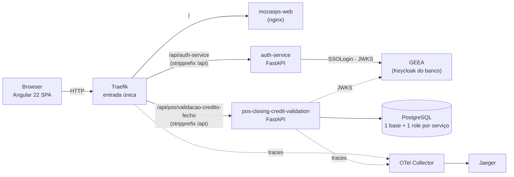
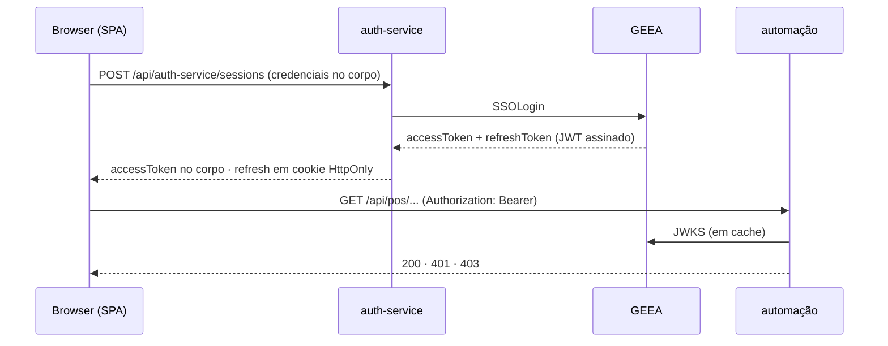

# Arquitetura — MozaOps

> Documento de referência do monorepo. Descreve **o que** o sistema é; o **porquê** de cada
> escolha, e as alternativas rejeitadas, está nos ADR em [`docs/adr/`](docs/adr/README.md).
>
> Alterações estruturais refletem-se aqui **e** dão origem a um ADR novo — os ADR existentes
> não se reescrevem, substituem-se.

---

## 1. Visão geral

Plataforma de automações operacionais do Moza Banco. Substitui o fecho manual em Excel —
exportar do Portal SIMO, do Banka e do MIS e cruzar à mão com `VLOOKUP` — por execuções
auditáveis e persistidas. Cada processo do departamento é uma **automação**: um módulo com a
sua página, as suas regras e as suas tabelas.



**Entrada única.** O SPA e a API partilham origem, por isso não há CORS nenhum para
configurar — é a razão principal de existir um proxy à frente. Em desenvolvimento o
`ng serve` faz o mesmo papel (`proxy.conf.json`), com a mesma reescrita de caminho: o que se
testa em dev é a topologia que corre em produção.

### Stack

| Camada | Tecnologia |
|---|---|
| Frontend | Angular 22 (standalone, signals, zoneless), Tailwind |
| Backend | Python 3.12, FastAPI, openpyxl |
| Pacotes | workspace `uv`, um lock para todo o backend |
| ORM / Migrações | SQLAlchemy 2 (async, asyncpg), Alembic |
| Base de dados | PostgreSQL 18 |
| Entrada / routing | Traefik v3 |
| Identidade | GEEA — o Keycloak corporativo, já federado com o AD |
| Observabilidade | OpenTelemetry Collector → Jaeger |
| Contentores | Docker Engine, Docker Compose |

---

## 2. Decomposição

Um serviço por **bounded context**, não por funcionalidade nem por departamento. O
departamento é metadado (`service.yaml`): muda mais depressa que o código, e a mesma
automação serve mais do que um.

| Serviço | Responsabilidade | Estado |
|---|---|---|
| `business/reconciliation/pos-closing-credit-validation` | Validação de crédito de valores de fecho do POS: parse dos ficheiros, reconciliação, persistência e relatório | **construído** |
| `platform/auth-service` | Sessões e áreas: fala com o GEEA, devolve token e cookie de renovação, e diz ao SPA quem está do outro lado | **construído** |
| `cases` | Gestão dos casos de divergência, quando deixar de ser suficiente vivê-los dentro da reconciliação | por fazer |

`pos-closing-credit-validation` é específico do POS, de propósito — não «a mesma automação
para os três canais». ATM e Quiosques têm ficheiros de entrada e regras de negócio diferentes
o suficiente para não valer a pena um serviço só a servi-los aos três; quando chegar a vez de
cada canal, ganha o seu próprio serviço em `business/`, independente deste.

**Só está aqui o que existe.** Prometer serviços que ainda não foram construídos gasta a
confiança de quem lê — a mesma regra que o catálogo do frontend segue.

---

## 3. Camadas de um serviço

Cinco camadas irmãs, num só sentido: **`controllers → services → repositories →
infrastructure`**, com o `domain/` no meio a não depender de ninguém. O controlador nunca toca
na base de dados; o repositório nunca decide regra de negócio. Ver
[ADR 0008](docs/adr/0008-cinco-camadas-por-servico.md).

```
backend/services/business/reconciliation/pos-closing-credit-validation/
├── app/
│   ├── main.py                composition root: a app, o router, os handlers, o /health
│   ├── settings.py            o que o serviço lê do ambiente — e só o que lê
│   ├── pagination.py          page/perPage → skip/take
│   ├── controllers/           executions · cases · schemas · dependencies · error_handlers
│   ├── services/              validation_service · case_service
│   ├── domain/                vocabulary · models · keys · reconciliation · errors
│   ├── repositories/          execution_repository · case_repository
│   └── infrastructure/        database · tables · excel/(workbook · parsers · report)
├── migrations/                Alembic
├── tests/
├── alembic.ini · pyproject.toml
└── service.yaml               contrato do serviço, legível por máquina
```

**`domain/` é puro** — sem FastAPI, sem SQLAlchemy, sem openpyxl. É aí que vive o valor da
automação, e é o que permite testar a reconciliação sem levantar nada. É também onde o
**vocabulário** é declarado uma vez (`vocabulary.py`, em `StrEnum`): os cinco estados de
validação, os tipos de fecho, os estados de caso e os campos de upload.

**Os erros do domínio não conhecem HTTP.** A tabela que os traduz em estado e código vive só
em `controllers/error_handlers.py`, e é percorrida pela MRO — uma subclasse nova de
`BusinessRuleError` cai no 422 sem se lhe tocar.

**Os repositórios recebem a sessão e nunca a criam.** É a regra que substitui uma unit of
work: quem a abre é o `Depends` do pedido, e é por isso que tudo o que corre dentro dele
partilha a transacção.

**Três línguas, cada uma no seu sítio.** O Python é snake_case, as colunas e o JSON são
camelCase. A ponte é o nome explícito na coluna (`mapped_column("posId", …)`) e o alias no
schema (`alias_generator=to_camel`) — nenhum dos dois contratos se dobra ao outro.

**`libs/` só tem o que tem dois consumidores.** Hoje é o `mozaops_libs/auth`: validar tokens
do GEEA e decidir áreas, partilhado pelo `auth-service` e pela automação. Autenticação diferente
entre dois serviços da mesma aplicação não é diferença de estilo — é a porta que fica aberta
no que ficou para trás. Nunca tabelas, nunca regra de negócio.

---

## 4. Estrutura do monorepo

```
ops/
├── ARCHITECTURE.md · OWNERS.md · Makefile
├── docker-compose.yml · docker-compose.override.yml · .env.example
├── backend/
│   ├── pyproject.toml         workspace uv (membros: libs, services/*)
│   ├── uv.lock                um lock para todo o backend
│   ├── Dockerfile             um para todos os serviços, via --build-arg SERVICE
│   ├── libs/                  mozaops_libs — auth: tokens do GEEA e mapa de áreas
│   └── services/
│       ├── platform/auth-service/
│       └── business/reconciliation/pos-closing-credit-validation/
├── external-services/
│   └── geea-keycloak/         mock do GEEA para desenvolvimento (NÃO é serviço nosso)
├── frontend/                 SPA Angular (features por área → ilha)
├── infra/
│   ├── postgres/initdb/       cria base + role por serviço, com REVOKE cruzado
│   ├── traefik/               configuração estática (as rotas são labels no compose)
│   └── otel/                  collector
├── scripts/verify-m0.sh
└── docs/adr/
```

**Um Dockerfile para todos os serviços.** O workspace `uv` resolve `libs/` por caminho, o
que obriga o contexto de build a ser `backend/` inteiro; dois ficheiros idênticos dentro das
pastas dos serviços seriam duplicação a ter de andar sincronizada. O que muda é o nome, e vai
em `--build-arg SERVICE`.

**As rotas não vivem num ficheiro central.** São labels no `docker-compose.yml`, ao lado do
serviço a que pertencem — um serviço novo não obriga a editar configuração partilhada.

---

## 5. Isolamento de dados

Uma **base e um role por serviço**, no mesmo servidor, com as ligações cruzadas revogadas
(`REVOKE CONNECT ... FROM PUBLIC`). «Database per service» não exige um servidor por serviço
— exige que nenhum serviço consiga chegar à base do outro, e é o `REVOKE` que garante isso.
Sem ele, no dia em que alguém escrever um JOIN entre bases, a regra deixou de existir.

Verifica-se assim, e tem de falhar:

```bash
docker compose exec postgres psql -U pos_closing_credit_validation -d mozaops_cases
# FATAL: permission denied for database "mozaops_cases"
```

---

## 6. Autenticação e acesso

**Quem autentica é o GEEA** — o Keycloak corporativo, já federado com o Active Directory. O
MozaOps não tem servidor de identidade próprio, nem tabela de utilizadores, nem password para
gerir: as credenciais são as do Windows.



Três regras que sustentam o resto:

1. **Emitir é do GEEA; validar é de cada serviço.** Só o `auth-service` fala com o GEEA; todos os
   outros verificam a assinatura localmente pelo JWKS em cache. Uma queda do GEEA impede
   logins novos, não o trabalho de quem já entrou.
2. **O token de acesso vive em memória no browser**, nunca em `localStorage` — aí, um XSS
   valeria uma sessão inteira em vez de um pedido. O que sobrevive ao recarregar é o cookie
   `HttpOnly` de renovação, que o JavaScript da página não lê.
3. **O acesso é por área, e não por papel.** A área é a unidade do MozaOps — hoje
   `channels` (código GEEA `3230`, «Canais e Serviços de Integração»); cada automação pertence
   a uma, e quem for da área faz tudo o que ela faz. O mapa unidade-do-GEEA → área está em
   `AUTH_AREAS`.

**Quem provisiona o acesso é o realm.** Os tokens do QAS trazem, em
`resource_access["qa-mozaops"].roles`, os papéis que o cliente do MozaOps tem para aquela
pessoa — `channels`, `payment-methods`, `fraud-monitoring` — e cada papel tem o **nome da
área** que abre. É essa a fonte principal: dar acesso a alguém é um pedido ao IAM, no sítio
onde o banco já trata de tudo o resto, e não uma variável de ambiente a mudar e um serviço a
reiniciar. O nome do papel e o id da área são a mesma cadeia de caracteres — mudar um sem o
outro tira o acesso a quem o tinha.

O `all-areas` é a excepção: abre o MozaOps inteiro, incluindo o que ainda não foi construído,
e existe para quem tem de ver tudo sem voltar ao realm a cada automação nova. Quem o tem entra
em qualquer sítio, por isso dá-se com o mesmo critério com que se dá a chave toda. Vai no
`/me` como vem, e o SPA reconhece-o para não esconder nada — expandi-lo no backend obrigaria o
servidor a conhecer o catálogo do frontend.

O `AUTH_AREAS` (unidade orgânica) e o `AUTH_AREA_USERS` (pessoa a pessoa) ficam como rede por
baixo, e **somam-se** aos papéis: servem as unidades que o realm ainda não provisionou, e quem
está registado numa unidade mas trabalha noutra — o caso de quem trata dos fechos e aparece no
GEEA com o código do departamento inteiro (`2350`). Tirar acesso a alguém é tirá-lo nos dois
sítios.

Só contam os papéis do **nosso** cliente. Os de `realm_access` são do sistema de workflow do
banco e não dizem nada sobre o MozaOps, mesmo quando têm um nome parecido; e os de outro
cliente são os acessos dessa pessoa noutra aplicação. O cliente de onde se lêem os papéis é
o `AUTH_CLIENT_ID`, e **não o `azp` do token**: quem pede o token deixa de ser quem nos diz o
que pode fazer, e admitir mais um cliente na lista de `AUTH_ALLOWED_AZP` passa a ser admitir
um cliente — e não delegar-lhe a atribuição dos nossos acessos. É isso que deixa a porta
aberta para os programas se autenticarem por segredo de cliente sem redesenhar nada. Do token
verificam-se sempre a assinatura, o `iss` e o `azp`.

**Acesso a uma automação só, sem dar a área inteira.** A área é grossa: quem a tem faz tudo o
que as automações dela fazem. Ao lado dela há a concessão fina, no papel
`service:<id-do-serviço>:read` ou `:write`, onde o id é o `AUTH_SERVICE_ID` que o serviço
declara. Serve dois casos com o mesmo acto: um programa de outro departamento que integre
connosco, e uma pessoa que precise de consultar uma automação sem lhe mexer.

**Nada no código distingue pessoa de programa.** Os dois autenticam-se pelo
`/api/auth-service/sessions` e recebem os acessos pela mesma via; o que varia é o que lhes foi
concedido. Uma distinção que nunca fosse testada seria peso morto — e amarraria a autorização
à forma como o token foi obtido, que é justamente o que muda no dia em que os programas
passarem a usar contas de serviço.

O nível exigido sai do **método HTTP**: `GET`/`HEAD` pedem `read`, o resto pede `write`. Não há
lista de rotas a manter, e uma rota nova que mute nasce a exigir escrita sem ninguém a marcar.
As duas vias somam-se — quem é da área passa como sempre passou, e a concessão só decide para
quem não a tem. Consequência a assumir: **para dar a alguém só leitura, essa pessoa não pode
ter a área**, senão a área ganha.

**Vocabulário, porque é onde isto se confunde:** no nosso código `area` é a área do MozaOps —
uma unidade orgânica real, não um departamento inteiro. «Meios de Pagamentos e Canais» é o
Departamento de Apoio Operacional visto por fora; lá dentro há várias áreas distintas
(`channels`, e «Serviço de Meios de Pagamento», código `2442`, ainda sem automação). O
departamento é agrupamento visual da barra lateral; a área é a unidade de acesso.
`department`/`departmentCode` são as claims do GEEA — a unidade orgânica onde a pessoa está
registada, que tanto pode ser um departamento como uma área ou um serviço.

Em desenvolvimento, o GEEA é simulado por `external-services/geea-keycloak`, que assina RS256
com uma chave própria e publica o JWKS. Vive fora de `backend/` de propósito: não é um serviço
nosso.

---

## 7. O que ainda não está feito

Registado aqui para não passar por esquecimento:

- **Login por reencaminhamento.** O SPA recolhe a password e o `auth-service` entrega-a ao
  `SSOLogin` — é o contrato que o GEEA expõe hoje. O fluxo `authorization_code`, em que o
  MozaOps nunca vê a password, espera pelo registo do `redirect_uri` no realm QAS.
- **Tracing.** O Traefik exporta para o collector; os serviços ainda não instrumentam.
- **Execução assíncrona.** A reconciliação corre dentro do request. O trabalho síncrono —
  ler os Excel, reconciliar, desenhar o relatório — sai para uma thread, para não parar o
  event loop do worker: no loop, um upload grande deixava o serviço sem responder a nada,
  nem ao `/health`, e o gunicorn contava o silêncio como worker morto e matava-o a meio.
  Isto tira o pior sintoma, não o limite: um ficheiro grande o suficiente continua a bater
  no `--timeout 60` antes de a fila existir.

---

## 8. Convenções

**Tudo em inglês, excepto o que o operador lê.** Pastas, ficheiros, classes, funções,
variáveis de ambiente, tabelas e ids de área são ingleses. Fica em português apenas o **conteúdo**:
as mensagens que o operador lê, os rótulos do relatório, os textos da interface e a
documentação — comentários incluídos. Nomes próprios não se traduzem: `SIMO`, `Banka`, `POS`,
`eTicket`, `MZN`.

As **rotas** são a excepção herdada: `/pos/validacao-credito-fecho` mantém os segmentos em
português do MozaOps v1, porque é o contrato que o frontend já consome.

**Como se escrevem os nomes** — cada camada na convenção da sua linguagem, e as pontes
declaradas em vez de assumidas:

| Onde | Convenção | Exemplo |
|---|---|---|
| Python | snake_case (PEP 8) | `simo_key_total` |
| Colunas Postgres | camelCase | `"simoKeyTotal"` |
| JSON da API | camelCase | `simoKeyTotal` |
| TypeScript | camelCase | `simoKeyTotal` |

A ponte do lado da base é o nome explícito na coluna
(`simo_key_total: Mapped[Decimal] = mapped_column("simoKeyTotal", Money)`); a ponte do lado do
JSON é o alias do schema (`alias_generator=to_camel`). **Nenhum dos dois contratos se dobra ao
outro**: as colunas ficam camelCase porque renomeá-las obriga a migrar uma base com execuções
reais, e o JSON fica camelCase porque é o que o `models.ts` do SPA consome.

Corolário prático: quando uma chave em camelCase aparece numa *string* de código Python, ou é
um nome de coluna, ou uma chave do documento JSONB, ou um campo de formulário — nunca um
atributo. Foi essa a regra que guiou a passagem a PEP 8, e está registada na
[ADR 0008](docs/adr/0008-cinco-camadas-por-servico.md).

Glossário do domínio: `fecho → closing`, `caso → case`, `chave → key`,
`comerciante → merchant`, `execução → execution`,
`confere/incorrecto/não creditado → match/mismatch/missing`. `closing` e não `settlement` —
settlement implicaria movimento de fundos, que é o lado Banka, e apagaria a distinção entre
os dois lados da reconciliação.

---

## 9. Arrancar e verificar

```bash
cp .env.example .env     # ajustar as senhas
make up                  # traefik, postgres, auth-service, otel, jaeger e os serviços
# o GEEA simulado sobe à parte — não é um serviço nosso:
docker compose -f external-services/geea-keycloak/docker-compose.yml up -d
make migrate             # alembic upgrade head
make lint                # ruff (regras e formato) e mypy --strict
make test                # testes do backend
```

Estes dois últimos correm sozinhos em cada push e em cada pull request
(`.github/workflows/ci.yml`), a que se junta o `npm test` e o build de produção do frontend.
O workflow invoca o `make` e o `npm` em vez de repetir os comandos: duas definições do que é
«verde» divergem, e a que falha é sempre a que ninguém corre à mão.

| | |
|---|---|
| Frontend (dev) | `cd frontend && npm start` → http://localhost:4200 |
| API (dev, direto) | http://localhost:8001 |
| GEEA (mock) | http://127.0.0.1:8100 |
| Jaeger | http://jaeger.mozaops.localhost |
| Painel do Traefik | http://127.0.0.1:8080 |

A ligação ponta a ponta prova-se pelo proxy do frontend, que é o caminho que o browser faz:

```bash
curl -i http://localhost:4200/api/pos/validacao-credito-fecho/execucoes/ultima
# 200 com a última execução, ou 204 se ainda não houver nenhuma
```

> **`make clean` apaga os volumes.** A base local pode ter execuções reais do departamento —
> dados bancários. Não é comando para correr por hábito.

---

## 10. Aviso

Os ficheiros `.xlsx` do departamento são **dados bancários reais** e estão excluídos do
controlo de versões (`.gitignore`). Não os commitar, em circunstância nenhuma.
