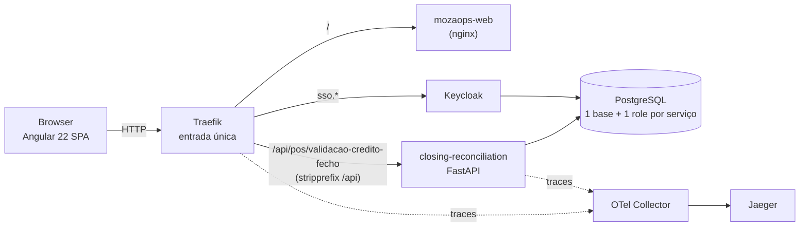

# Arquitetura — MozaOps

> Documento de referência do monorepo. Descreve **o que** o sistema é; o **porquê** de cada
> escolha, e as alternativas rejeitadas, está nos ADR em [`docs/adr/`](docs/adr/README.md).
>
> Alterações estruturais refletem-se aqui **e** dão origem a um ADR novo — os ADR existentes
> não se reescrevem, substituem-se.

---

## 1. Visão geral

Plataforma de automações operacionais do Moza Banco. Substitui o fecho manual em Excel —
exportar do Portal SIMO, do Banka e do MIS e cruzar à mão com `VLOOKUP` — por execuções
auditáveis e persistidas. Cada processo do departamento é uma **automação**: um módulo com a
sua página, as suas regras e as suas tabelas.



**Entrada única.** O SPA e a API partilham origem, por isso não há CORS nenhum para
configurar — é a razão principal de existir um proxy à frente. Em desenvolvimento o
`ng serve` faz o mesmo papel (`proxy.conf.json`), com a mesma reescrita de caminho: o que se
testa em dev é a topologia que corre em produção.

### Stack

| Camada | Tecnologia |
|---|---|
| Frontend | Angular 22 (standalone, signals, zoneless), Tailwind |
| Backend | Python 3.12, FastAPI, openpyxl |
| Pacotes | workspace `uv`, um lock para todo o backend |
| ORM / Migrações | SQLAlchemy 2 (async, asyncpg), Alembic |
| Base de dados | PostgreSQL 18 |
| Entrada / routing | Traefik v3 |
| Identidade | Keycloak (**ainda não ligado** — ver §6) |
| Observabilidade | OpenTelemetry Collector → Jaeger |
| Contentores | Docker Engine, Docker Compose |

---

## 2. Decomposição

Um serviço por **bounded context**, não por funcionalidade nem por departamento. O
departamento é metadado (`service.yaml`): muda mais depressa que o código, e a mesma
automação serve mais do que um.

| Serviço | Responsabilidade | Estado |
|---|---|---|
| `closing-reconciliation` | Validação de crédito de valores de fecho: parse dos ficheiros, reconciliação, persistência e relatório | **construído** (POS) |
| `cases` | Gestão dos casos de divergência, quando deixar de ser suficiente vivê-los dentro da reconciliação | por fazer |

A mesma automação serve os três canais — POS, ATM e Quiosques. Muda o ficheiro de entrada,
não a regra: por isso é um serviço e não três.

**Só está aqui o que existe.** Prometer serviços que ainda não foram construídos gasta a
confiança de quem lê — a mesma regra que o catálogo do frontend segue.

---

## 3. Camadas de um serviço

Regra base, num só sentido: **`routes → service → repository → models`**. O router nunca
toca na base de dados; o repositório nunca decide regra de negócio.

```
backend/services/closing-reconciliation/
├── app/
│   ├── main.py            app FastAPI, /health e os handlers de erro
│   ├── routes.py          HTTP — valida o pedido e chama o service
│   ├── service.py         casos de uso, orquestração, transação
│   ├── repository.py      único ponto de acesso à base de dados
│   ├── models.py          tabelas SQLAlchemy
│   ├── serializers.py     modelos → JSON (espelha o models.ts do frontend)
│   ├── database.py        engine e sessão async
│   ├── errors.py          ApiError · BusinessError · NotFoundError
│   ├── pagination.py      page/perPage → skip/take
│   ├── settings.py        variáveis de ambiente tipadas
│   ├── domain/            keys · models · reconciliation
│   └── infra/             excel · parsers · report   (openpyxl)
├── migrations/            Alembic
├── tests/
├── alembic.ini · pyproject.toml
└── service.yaml           contrato do serviço, legível por máquina
```

**`domain/` é puro** — sem FastAPI, sem SQLAlchemy, sem openpyxl. É aí que vive o valor da
automação, e é o que permite testar a reconciliação sem levantar nada.

**`libs/` está vazio, e é de propósito.** Utilitários técnicos partilhados entram no dia em
que houver um segundo consumidor — nunca tabelas, nunca regra de negócio.

---

## 4. Estrutura do monorepo

```
ops/
├── ARCHITECTURE.md · OWNERS.md · Makefile
├── docker-compose.yml · docker-compose.override.yml · .env.example
├── backend/
│   ├── pyproject.toml         workspace uv (membros: libs, services/*)
│   ├── uv.lock                um lock para todo o backend
│   ├── Dockerfile             um para todos os serviços, via --build-arg SERVICE
│   ├── libs/                  mozaops_libs — vazio até ao 2.º consumidor
│   └── services/
│       └── closing-reconciliation/
├── frontend/mozaops-web/      SPA Angular (features por departamento → ilha)
├── infra/
│   ├── postgres/initdb/       cria base + role por serviço, com REVOKE cruzado
│   ├── traefik/               configuração estática (as rotas são labels no compose)
│   ├── keycloak/              realm exportado
│   └── otel/                  collector
├── scripts/verify-m0.sh
└── docs/adr/
```

**Um Dockerfile para todos os serviços.** O workspace `uv` resolve `libs/` por caminho, o
que obriga o contexto de build a ser `backend/` inteiro; dois ficheiros idênticos dentro das
pastas dos serviços seriam duplicação a ter de andar sincronizada. O que muda é o nome, e vai
em `--build-arg SERVICE`.

**As rotas não vivem num ficheiro central.** São labels no `docker-compose.yml`, ao lado do
serviço a que pertencem — um serviço novo não obriga a editar configuração partilhada.

---

## 5. Isolamento de dados

Uma **base e um role por serviço**, no mesmo servidor, com as ligações cruzadas revogadas
(`REVOKE CONNECT ... FROM PUBLIC`). «Database per service» não exige um servidor por serviço
— exige que nenhum serviço consiga chegar à base do outro, e é o `REVOKE` que garante isso.
Sem ele, no dia em que alguém escrever um JOIN entre bases, a regra deixou de existir.

Verifica-se assim, e tem de falhar:

```bash
docker compose exec postgres psql -U closing_reconciliation -d mozaops_cases
# FATAL: permission denied for database "mozaops_cases"
```

---

## 6. O que ainda não está feito

Registado aqui para não passar por esquecimento:

- **Autenticação.** O backend não valida nada — todas as rotas estão abertas — e o frontend
  corre com `authDisabled: true`, a injetar uma sessão de desenvolvimento. O Keycloak já sobe
  e já tem o realm importado, mas nada o consulta. **Não é estado para produção.**
- **Tracing.** O Traefik exporta para o collector; os serviços ainda não instrumentam.
- **Execução assíncrona.** A reconciliação corre dentro do request. Um ficheiro grande o
  suficiente vai bater no timeout antes de a fila existir.
- **CI.** Não há pipeline.

---

## 7. Convenções

**Tudo em inglês, excepto o que o operador lê.** Pastas, ficheiros, classes, funções,
variáveis de ambiente, tabelas e papéis são ingleses. Fica em português apenas o **conteúdo**:
as mensagens que o operador lê, os rótulos do relatório, os textos da interface e a
documentação — comentários incluídos. Nomes próprios não se traduzem: `SIMO`, `Banka`, `POS`,
`eTicket`, `MZN`.

As **rotas** são a excepção herdada: `/pos/validacao-credito-fecho` mantém os segmentos em
português do MozaOps v1, porque é o contrato que o frontend já consome.

Glossário do domínio: `fecho → closing`, `caso → case`, `chave → key`,
`comerciante → merchant`, `execução → execution`,
`confere/incorrecto/não creditado → match/mismatch/missing`. `closing` e não `settlement` —
settlement implicaria movimento de fundos, que é o lado Banka, e apagaria a distinção entre
os dois lados da reconciliação.

---

## 8. Arrancar e verificar

```bash
cp .env.example .env     # ajustar as senhas
make up                  # traefik, postgres, keycloak, otel, jaeger e os serviços
make migrate             # alembic upgrade head
make test                # testes do backend
```

| | |
|---|---|
| Frontend (dev) | `cd frontend/mozaops-web && npm start` → http://localhost:4200 |
| API (dev, direto) | http://localhost:8001 |
| Keycloak | http://sso.mozaops.localhost |
| Jaeger | http://jaeger.mozaops.localhost |
| Painel do Traefik | http://127.0.0.1:8080 |

A ligação ponta a ponta prova-se pelo proxy do frontend, que é o caminho que o browser faz:

```bash
curl -i http://localhost:4200/api/pos/validacao-credito-fecho/execucoes/ultima
# 200 com a última execução, ou 204 se ainda não houver nenhuma
```

> **`make clean` apaga os volumes.** A base local pode ter execuções reais do departamento —
> dados bancários. Não é comando para correr por hábito.

---

## 9. Aviso

Os ficheiros `.xlsx` do departamento são **dados bancários reais** e estão excluídos do
controlo de versões (`.gitignore`). Não os commitar, em circunstância nenhuma.
